# AI & Data Science Competition Portfolio


Welcome to my global competition portfolio! This repository serves as a centralized hub for all my competitive data science and AI endeavors, spanning **Natural Language Processing (NLP)**, **Computer Vision (CV)**, and **Machine Learning (ML)**.
It is my new year competition portfolio.
Previous portfolio can be found [here](https://github.com/yehoshua0/y_datascience_projects) and [there](https://github.com/yehoshua0/yhsml).

<p align="center">
  <a href="https://zindi.africa/users/aaaml007">
    
  </a>
  <a href="https://zindi.africa/users/aaaml007">
    
  </a>
  <a href="https://zindi.africa/users/aaaml007">
    
  </a>
  <br>
  <b>🏆 Zindi Performance 🏆</b><br>
  <i>Top Competitive Data Scientist at Zindi Africa</i>
</p>
---

## 🏆 Featured Competitions

| Competition                                                                   | Domain | Platform | Core Tech                 | Highlights                                              |
| :---------------------------------------------------------------------------- | :----- | :------- | :------------------------ | :------------------------------------------------------ |
| **[Telco Troubleshooting](./The%20AI%20Telco%20Troubleshooting%20Challenge)** | NLP    | -        | Qwen2.5, SFT, LoRA        | Specialised edge-cloud LLM for network fault detection. |
| **[Helios Corn Futures](./Helios%20Corn%20Futures%20Climate%20Challenge)**    | ML     | Helios   | Climate Data, Forecasting | Climate challenge focused on commodity futures (WIP).   |

---

## 🛠️ Repository Structure

Each competition is self-contained within its own directory following a standardized structure:

```text
Competition Name/
├── data/           # Datasets (sampled or links)
├── notebooks/      # Exploratory Data Analysis & Modeling
├── src/            # Productionized source code & utilities
├── scripts/        # Automation and data processing scripts
├── submissions/    # Final predictions and submission logs
└── README.md       # Detailed competition report and reproduction steps
```

---

## ⚙️ Deployment & Setup

Most projects use a standardized Python environment.

1.  **Clone the Repo:**
    ```bash
    git clone https://github.com/yehoshua0/competitions.git
    cd competitions
    ```
2.  **Environment Setup:**
    Check the `README.md` or `requirements.txt` within specific competition folders for dependency installation.

---

## 📫 Connect with Me

- **LinkedIn:** [yehoshua1](https://www.linkedin.com/in/yehoshua1/)
- **Kaggle:** [aaaml007](https://www.kaggle.com/aaaml007)
- **Portfolio Website:** [yehoshua.vercel.app](http://yehoshua.vercel.app/)

---

_Last Updated: 2026-01-31_
