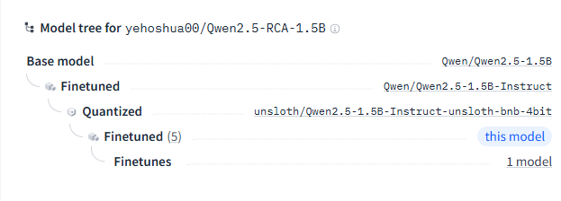

- Why you use "unsloth/Qwen2.5-1.5B-Instruct-unsloth-bnb-4bit" instead of "Qwen/Qwen2.5-1.5B-Instruct"?
- [Clarification on quantized model and multi-model structure](https://zindi.africa/competitions/the-ai-telco-troubleshooting-challenge/discussions/30050), here the host allowed us to train and submit solutions based on quantized models (not only the full size models). And, beyond that, [Unsloth's Dynamic 4-bit](https://unsloth.ai/blog/dynamic-4bit) Quants is selectively quantized, greatly improving accuracy over standard 4-bit. As you can see the img below, we didn't break challenges rules which is to stick to use only the provided models. 

-