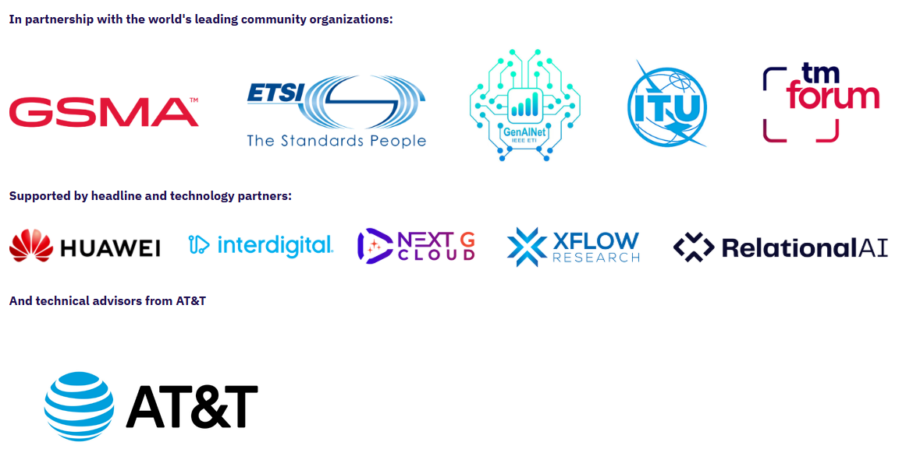

Our sincere thanks go to the competition organizers for their hard work and for providing such a valuable opportunity.

This work would not have been possible without these excellent resources made available to everyone.

- [How to Set Up and Run Qwen 3 Locally With Ollama](https://www.datacamp.com/tutorial/qwen3-ollama)

- [Easily fine-tune & train LLMs, Get faster with unsloth](https://colab.research.google.com/github/unslothai/notebooks/blob/main/nb/Qwen2.5_(7B)-Alpaca.ipynb)

- [vLLM - Easy, fast, and cheap LLM serving for everyone](https://docs.vllm.ai/en/latest/serving/offline_inference/#ray-data-llm-api)

- [Kaggle, Your Home for Data Science](https://docs.vllm.ai/en/latest/serving/offline_inference/#ray-data-llm-api)

- [Colab is a hosted Jupyter Notebook service that requires no setup to use and provides free access to computing resources, including GPUs and TPUs.](https://colab.google/)

- [💫 Intel® LLM Library for PyTorch*](https://github.com/intel/ipex-llm)

